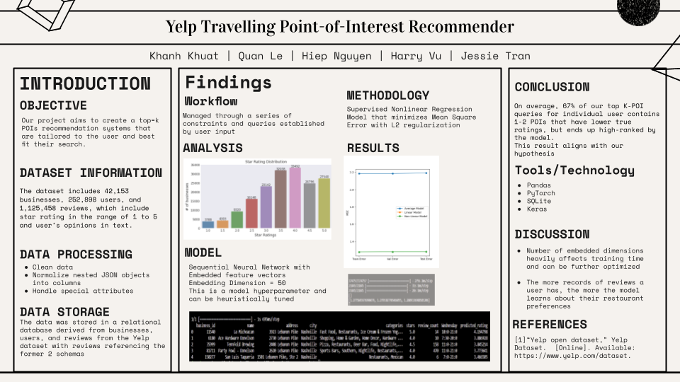

  

# Yelp Travelling Point-of-Interest Recommender

### Members
- Khanh Khuat (ltk30)
- Jessie Tran (nvt5)
- Harry Vu (htv5)
- Hiep Nguyen (hln6)
- Quan Le (qml2)

## 1. Introduction

### Background
In the era of data-driven recommendation systems, platforms like Yelp enhance user experience by connecting users to local businesses through "Point of Interest" (POI) features. Our project leverages Yelp's extensive data to create a user-centric POI recommendation system.

### Problem Definition & Motivation
We aim to develop a POI recommendation system that is both sophisticated in its analytical capabilities and personalized to user preferences using the Yelp dataset, addressing the challenge of efficiently managing and analyzing large datasets.

### Objectives
Our objective is to improve the existing POI recommendation systems, making them more personalized, accurate, and context-aware, and capable of generating top-k recommendations that reflect user's historical interactions and preferences.

## 2. Methodology

### Algorithm
We designed a Supervised Nonlinear Regression Model using PyTorch and Keras, minimizing Mean Square Error with L2 regularization and embedding feature vectors to capture user preferences.

### Data Collection
Data was sourced from Yelp's Open Dataset, comprising reviews, user interactions, and business information.

## 3. Experimental Setup and Results

### Data Model
The relational data model was chosen for its efficiency and suitability for structured and interrelated data, like Yelp's dataset.

### Database Statistics
- **Businesses**: 42,153 records.
- **Users**: 252,898 records.
- **Reviews**: 1,125,458 records.

### Data Processing
Data from Yelp's JSON files were parsed and transformed for storage in an SQLite database, enabling complex analyses and queries.

## 5. Discussion

### Insights and Implications
The project reveals the importance of personalization and data integrity, highlighting challenges with large datasets and the need for scalable algorithms.

### Limitations
Considerations include user exploration limitations, popularity bias, and the scalability challenge for real-time updates.

## 6. Conclusion

Our model, on average, successfully incorporates 67% of top-k POIs into user recommendations, validating our hypothesis and highlighting the importance of data-driven personalization.

## 7. References
- Yelp Open Dataset: [Yelp Dataset](https://www.yelp.com/dataset)